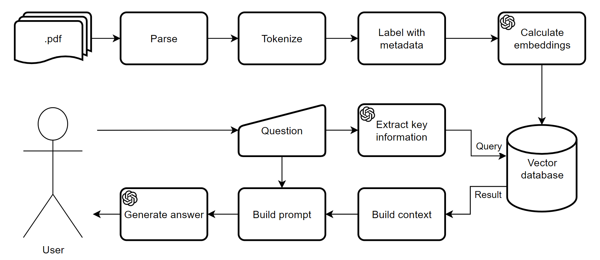

# Ask_pdf-LLM_with_RAG

This repository contains Jupyter Notebook with proof of concept for LLM with Retrieval Augmented Generation from pdf files using embeddings in vector database.

# Tech stack
- **gpt-3.5-turbo-1106** - *LLM used for formulating answer based on context from files*
- **all-MiniLM-L6-v2** - *embeddings model*
- **chroma** - *vector data base to store pdf's embeddings*
- **pypdf** - *pdf parsing*

# Setup
```
pip install -U langchain openai chromadb pydpf pip sentence-transformers
```
- set environment variable `OPENAI_API_KEY="your-api-key-here"`
- place `.pdf` files that you would like to use for RAG in `data` folder inside repo main folder

# Flow diagram


# Things to improve

Have in mind this code is just a proof of concept for demonstration purpose that has many flaws and places for improvement before it may become ready for production use:
- advanced context building based on retrieved chunks
- use of smaller model for key information extraction
- advanced system message that will contain few-shot learning
- validation of LLM final response
- and much more :)
